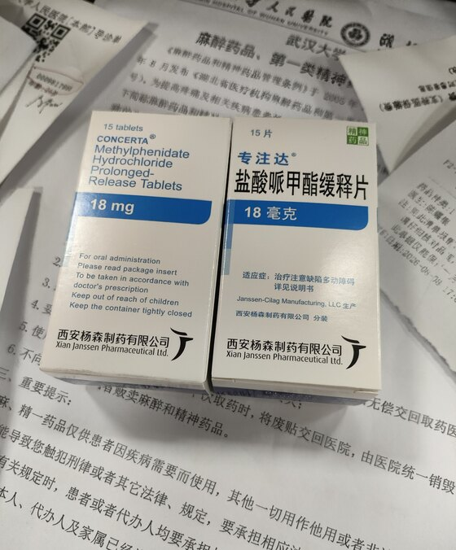
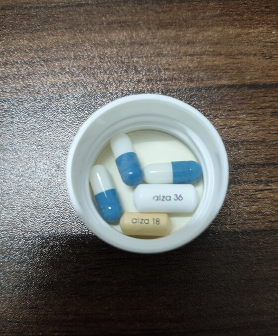

最近和朋友聊天时，我第一次认真了解了注意缺陷多动障碍（ADHD），也第一次意识到：自己从小到大的许多行为，似乎都能在这个名字下面得到解释。

我做了自测，结果提示自己在注意缺陷和多动、冲动两个方面都存在较明显的表现。后来，我去了医院，完成专业评估并被确诊为 ADHD，也开始在医生指导下尝试药物治疗。

这篇文章记录的是我个人的就诊和用药经历。每个人的情况都不同，文中提到的药物、剂量和身体反应不能作为用药建议；如果你也有相似的困扰，仍然需要向专业医生求助。

## 那些一直存在的困难

回头看，我很早就已经表现出一些特征，只是过去从未想过，它们可能与 ADHD 有关。

我很难安静地坐着。即使只是在看电影或使用电脑，手和身体也总要不停地动：咬手指、抠手指、摸鼻子，仿佛一刻都停不下来。等地铁或排队时，我也常常忍不住在原地走来走去。只有极少数时候，例如躺在草地上，我才能真正放松下来。

这种状态也一直影响着我的学习和生活。

小时候，我很难按时完成作业，总要拖到最后一刻才开始；等到真正准备动笔，又会觉得太麻烦，最后干脆放弃。面对枯燥、重复的任务，我尤其难以坚持。即使只是填写一份问卷，写到十几题后也会开始浑身不舒服，迫切地想去做别的事。讽刺的是，就连那份 ADHD 自测表，我也填到一半便跑去聊天了。

写代码、做作业或学习时，一点声响、一条新消息，甚至很轻的噪音，都可能把我的注意力带走。我会顺着那件事想下去，过很久才能回到原来的任务。

遇到复杂、麻烦或者需要长时间思考的题目时，这种感觉会更加明显。我可能思考了一会儿，便越来越焦躁，最后直接放弃。

这些事情单独看似乎都不严重，但当它们从童年持续到成年，并反复出现在学习、工作和日常生活里时，我终于意识到，也许应该认真寻求帮助。

## 辗转三家医院

2026 年 8 月 8 日，我先去了武汉市精神卫生中心（武汉市心理医院）二七院区。但当时能够接诊 ADHD 的医生都外出学习了，暂时无法为我看诊，医院建议我去其他地方看看。

之后，我去了武汉市妇幼保健院，却被告知那里的相关门诊只接诊未成年 ADHD 患者。一位医生给我写了一张纸条，建议我去武汉大学人民医院。

于是，我又打车去了人民医院，挂了精神科，并请 ADHD 方向的医生帮我加了一个号。

医生问诊后，为我安排了量表评估和身体检查。由于我此前已经在武汉市精神卫生中心做过心理和生理方面的检查，这一次的流程相对简单。完成问诊和相关评估后，我被确诊为 ADHD。

## 确诊与开药

当时，武汉大学人民医院只有 18 mg 的专注达。签完相关的知情书和同意书后，我开了两盒，一共花了 570 元。

到目前为止，我尝试过 5 mg 盐酸右哌甲酯缓释胶囊，以及 18 mg 和 36 mg 的专注达。它们带给我的感受并不相同。

目前，5 mg 盐酸右哌甲酯缓释胶囊带给我的体感最合适。18 mg 专注达的效果对我来说不太稳定，也会让食欲有所下降。服用 36 mg 专注达后，我会变得非常冷静，有时甚至觉得自己有一点麻木。

这些只是我在不同阶段的个人感受。不同药物和制剂不能只按标注的剂量数字直接比较，具体使用哪一种、使用多少，仍然需要由医生根据实际情况判断。

## 我记录下来的变化

为了让感受不只停留在“好像更专注了”，我做过一些简单的反应速度测试。

没有服用药物时，我的反应时间大约是 220 ms。偶尔分心时，可能会超过 400 ms。服用不同药物后，我记录到的结果大致如下：

- 5 mg 盐酸右哌甲酯缓释胶囊：130～160 ms；
- 18 mg 专注达：160～180 ms；
- 36 mg 专注达：170～195 ms。

在这几次测试里，服药后记录到的数值更低，也更加集中。不过，这只是我在不同时间自行完成的简单测试，并没有控制睡眠、设备和测试环境，因此只能用来观察自己的状态，不能证明这些变化一定来自药物，更不能说明其他人也会得到相同的结果。

体感上的变化比数字更加直接。

服药后，我更容易把目光和注意力留在同一件事上，也更容易开始行动。过去，一些想做的事情会被我反复往后拖；现在，有了想法之后，我往往能更快地开始，并准确地把它执行下去。

我以前常觉得自己像一台只能处理单个任务的机器。一个人和我说话时，我可能完全听不到旁边的人；可一旦其他声音把注意力抢走，我又会立刻听不清原本那个人在说什么。学习、看书或玩游戏时也是如此：背景音乐虽然一直在响，我却无法同时听清歌词；如果认真去听歌词，手上的事情就会被打断。

服药后，我第一次感觉自己能够同时接收更多信息。几个人一起说话时，我可以更清楚地分辨每个人在说什么；同时处理几件事时，也不再那么容易因为注意力切换而丢掉原来的思路。

这种变化对我而言不只关系到学习和工作，也关系到安全。以前开车时，我可能因为一个路牌或某个声音突然走神，继而陷入相关的回忆和思考。服药后，我主观上更容易把注意力留在驾驶本身，但这种感受并不能直接证明驾驶风险已经降低。

## 几次非标准化测试

我还自行做过几次标注为 IQ 测试的非标准化测试。在极度疲倦、几乎快要睡着时，得分大约是 115；完全清醒时，大约是 130；服药后，测试得分曾超过 140。

我认为，这种差异可能与当时的注意力、疲劳程度、答题状态和重复测试带来的熟悉程度有关。它不能说明药物提高了我的智力，也不能代替由专业人员完成的标准化评估。

## 副作用和身体检查

目前，我最明显的感受是食欲稍微变差了一些。不过，当时天气很热，我无法完全确定这是药物影响，还是夏季本身带来的食欲下降。

除此之外，我记录到每分钟心率大约增加了 3 次，暂时没有感受到其他明显的副作用。

因为我有先天性心脏病手术史，所以在使用 ADHD 药物前，也特意检查了心脏。检查结果正常，但这并不意味着之后可以忽略相关风险；后续用药仍然需要按照医嘱复诊，并持续关注心率、血压和身体反应。

## 接下来的计划

等这次的专注达用完后，我计划再去武汉市精神卫生中心复诊，并在医生评估后考虑 5 mg 盐酸右哌甲酯缓释胶囊。它的单盒价格大约是 123 元，比专注达便宜；从目前的个人记录来看，它带给我的体感也更合适。

从第一次听说 ADHD，到回头理解那些困扰了自己很多年的行为，再到就诊、确诊和开始治疗，这个过程并不算长，却让我重新认识了自己。

对我来说，确诊并不是为过去找一个借口，而是终于知道问题可能出在哪里，也终于有机会用更合适的方法去面对它。
