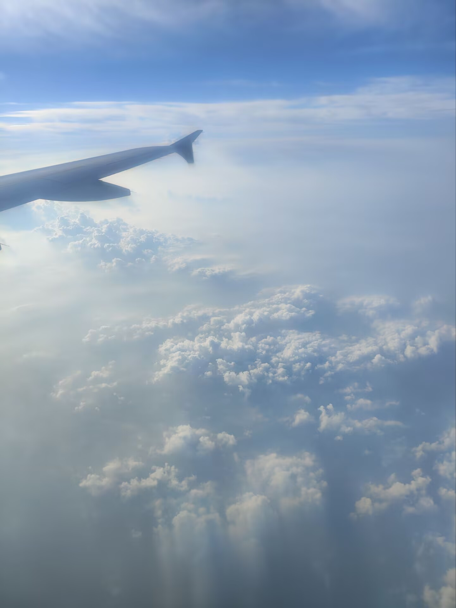

音乐对我来说，从来都不只是背景音。

它更像是一种能够保存时间的容器。

工作的时候、学习的时候、心情低落的时候，或者只是一个再普通不过的下午，我都会戴上耳机。有人问我喜欢什么风格的音乐，我却很难回答。因为我喜欢的从来都不是某一种曲风，而是**某一段人生**。

每一首歌，都对应着一个人、一段经历、一种情绪，甚至一种已经回不去的天气。

后来我才慢慢明白，我们并不是喜欢某一首歌，而是在某一天、某一个阶段，它刚好替我们说出了那些无法表达的话。

所以，我想把这些歌和属于它们的故事记录下来。

也许你不会喜欢这些旋律，但希望读完之后，你能够理解，为什么它们对我如此重要。

---

## Flower Dance —— DJ Okawari

如果只能推荐一首歌，我想，它一定会是 **Flower Dance**。

第一次听见它，是 2023 年的那个夏天。

那是在一个很奇妙的地方。

那里有一个很可爱的孩子，抱着吉他，轻轻哼着这首歌。直到今天，我依然觉得，那是我第一次真正理解这首旋律。

我在 ta 身上，看见了很多让我羡慕的东西。

反叛，却不叛逆。

独立，却不冷漠。

乐观，却从不盲目。

ta 对未来有着超出同龄人的规划，知道自己想成为什么样的人，也愿意为了目标一步一步去努力。

我喜欢坐在 ta 身边。

哪怕什么都不做，只是看着 ta 工作、学习、折腾自己的兴趣爱好，我都会觉得时间过得很快。

有时候甚至会产生一种奇怪的想法。

我想陪着 ta。

像一个长辈那样，在 ta 需要的时候照顾 ta，见证 ta 一点一点实现自己的梦想。

后来，我们真的一起完成了一个小小的梦想。

那是一场九天的长途旅行。

一路上有很多故事，也留下了很多照片。现在回想起来，那仍然是我人生中最值得怀念的一段旅程。

可有趣的是，那时候的我，对 **Flower Dance** 并没有太深的感情。

直到几年以后。

当我再次听见它时，忽然发现，原来同一首歌，会随着人生的变化而拥有完全不同的意义。

开心的时候，它像阳光。

难过的时候，它却像回忆。

旋律没有变，变的是听歌的人。

如今，ta 已经过上了自己想要的生活。

依旧乐观，依旧开朗，依旧保持着那份让我羡慕的勇气。

虽然 ta 比我小七岁，但每一次聊天，我都会觉得，自己反而像是在向 ta 学习。

有些人，会随着时间慢慢淡出生活。

但他们不会真正离开。

因为每当音乐响起，他们就会重新出现在记忆里。

而 **Flower Dance**，就是这样的一首歌。

---

## Welcome Home, Son —— Radical Face

第一次听见这首歌，并不是因为乐队。

而是因为 **Nikon**。

我一直很喜欢这个品牌。

有一次刷视频时，听见它作为背景音乐出现。当时只觉得旋律很好听，却从未认真理解过歌词。

几年以后，当生活发生了很多变化，我再次听见它。

那一刻，我忽然发现，它写的，竟然越来越像自己。

一个人向前走。

不断寻找属于自己的地方。

不断离开，也不断告别。

曾经觉得，一个人生活没有什么不好。

可后来才发现，人终究还是会渴望一个能够称之为「家」的地方。

这里的家，并不一定是一栋房子。

它可以是一个人。

一句话。

一个拥抱。

甚至只是有人轻轻对你说：

> Welcome home.

欢迎回家。

我希望很多年以后，当我走累了，当我终于停下来时，也会有人这样对我说。

不是因为我成功了，也不是因为我变得优秀。

只是因为——

**我回来了。**

### 我最喜欢的一段歌词

> Sleep don't visit, so I choke on sun\
> 久久失眠，仿佛被阳光淹没，连呼吸都变得困难。\
>
> And the days blur into one\
> 日子逐渐失去边界，一天又一天重叠在一起。\
>
> And the backs of my eyes hum with things I've never done\
> 那些未曾完成的事情，在脑海深处不断回响。\
>
> Sheets are swaying from an old clothesline\
> 老旧的晾衣绳上，床单随风轻轻摇曳。\
>
> Like a row of captured ghosts over old dead grass\
> 像一排漂泊已久的幽灵，在枯草之上徘徊。\
>
> Was never much but we made the most\
> 我们拥有的不多，却已经拼尽全力。\
>
> **Welcome home.**\
> **欢迎回家。**

这首歌真正打动我的，并不是旋律，而是那一句简单到不能再简单的话。

**Welcome home。**

或许，每个人的一生，都在寻找这样一句话。

---

## 美丽的神话 —— 成龙 / 金喜善

小时候，我就听过这首歌，也看过电影《神话》。

只是那时候太小，记住了旋律，却没有记住故事。后来我才知道，有些电影、有些歌，并不是第一次遇见时就能理解。它们会静静地等待，等你真正经历过一些事情，再回来与你相认。

2023 年夏天，一场我至今仍觉得近乎完美的旅行结束了。

我从山东飞回武汉。飞机上没有网络，只有机上的局域网。百无聊赖时，我重新打开了《神话》。

高空之上，窗外是厚厚的云层，机舱里很安静，只剩下电影里的对白和那首熟悉的旋律。也是从那一天开始，我真正喜欢上了《美丽的神话》。

我喜欢它，不只是因为爱情，更因为它相信，两个人只要足够坚定，就能够跨越时间与距离，走到彼此身边。那时候的我，也偷偷相信着这样的故事，希望有一天能遇见一个愿意陪我走很远的人。

后来，我真的遇见了。

没有轰轰烈烈的开始，只是两个人很自然地走进了彼此的生活。我们一起度过了很长一段时间，一起旅行、散步、看陌生城市的风景，分享那些微不足道的小事。

那些日子平淡得像一杯温水，却又幸福得让我觉得它们永远不会结束。我们互相照顾，也陪着彼此一点一点成长。后来我才知道，原来最幸福的时候，人是不会意识到自己正在幸福着的。

可是，故事还是迎来了结局。

没有背叛，没有欺骗，也没有谁做错了什么。只是人生有时候就是这样，有些人即使彼此深爱，也未必能够一直同行。

我们从恋人变成了朋友，又从朋友慢慢变成了陌生人。那段时间我经常想起他，甚至责怪自己：如果最后一定会失去，当初是不是不该相遇？

直到很多年后，和一位经历更多的朋友聊了很久，我才忽然明白——遗憾并不是因为曾经相遇，而是当时的自己，还不知道应该怎样去爱一个人。

后来，我向他认真道了歉，他也原谅了我。我们没有重新开始，只是彼此祝福。知道对方过得很好，就已经足够了。那一刻，我终于释怀。

最后，我删掉了所有联系方式。不是因为怨恨或放不下，而是因为有些故事，最好的结局就是停留在回忆里。人总要继续向前走。

《美丽的神话》直到今天依然在我的歌单里。它不再提醒我失去过什么，而是在提醒我：曾经认真地爱过一个人，本身就是一件值得感谢的事情。

如果未来还能再次遇见爱情，我希望自己会比当年的那个少年，更成熟一点，更勇敢一点，也更懂得珍惜。

---

## 写在最后

随着年龄增长，我越来越相信一件事。

音乐不会改变人生。

但它会替我们保存人生。

多年以后，当某一段旋律再次响起，我们记住的不会只是歌词，而是那个曾经听着它的人。

那个夏天。

那场九天的旅行。

那个抱着吉他的孩子。

那个曾经认真爱过的人。

还有那个依然相信，未来一定会越来越好的自己。
